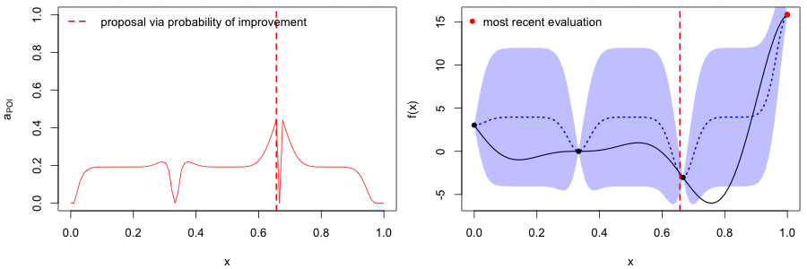
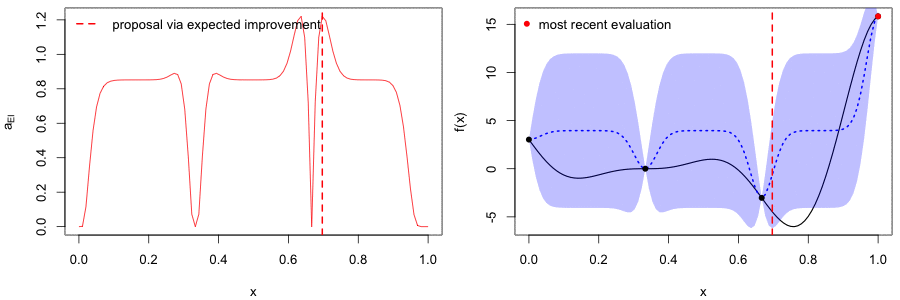
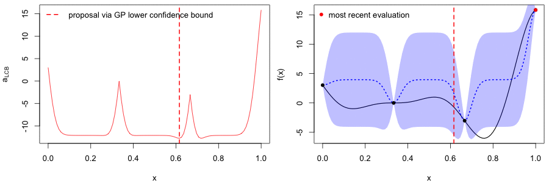

```{r setup, include=FALSE}
library(knitr)
library(kableExtra)
opts_chunk$set(echo = FALSE)
library(magrittr)
```
```{css}
a.wiki-preview {
    color: #0645ad;
    text-decoration: none;
    border-bottom: 1px dotted #0645ad;
}
.wiki-preview::after {
    font-family: serif;
    content: " W";
    vertical-align: super;
    font-size: 6pt;
}
```

<!-- https://chimeces.com/context-cards/ -->
<script src="context-cards.js"></script>

# Introduction

<a href="https://en.wikipedia.org/wiki/Mathematical_optimization" class='wiki-preview' data-wiki-lang='en' data-wiki-title='Mathematical optimization'>Optimization</a> of function $f$ is finding an input value $\mathbf{x}_*$ which minimizes (or maximizes) the output value:

$$
\mathbf{x}_* = \underset{\mathbf{x}}{\arg\min}~f(\mathbf{x})
$$

In this tutorial we will optimize $f(x) = (6x-2)^2~\text{sin}(12x-4)$[@Forrester], which looks like this when $x \in [0, 1]$:

```{r curve}
par(mar = c(4.1, 4.1, 0.5, 0.5), cex = 1.1)
curve((6 * x - 2)^2 * sin(12 * x - 4), 0, 1, xlab = "x", ylab = "f(x)", lwd = 2)
```

The ideal scenario is that $f$ is known, has a closed, analytical form, and is <a href="https://en.wikipedia.org/wiki/Differentiable_function" class='wiki-preview' data-wiki-lang='en' data-wiki-title='Differentiable function'>differentiable</a> -- which would enable us to use <a href="https://en.wikipedia.org/wiki/Gradient_descent" class='wiki-preview' data-wiki-lang='en' data-wiki-title='Gradient descent'>gradient descent</a>-based algorithms For example, here's how we might optimize it with Adam[@Adam] in TensorFlow[@r-tf]:

```{r tf, echo=TRUE, eval=FALSE}
library(tensorflow)
sess = tf$Session()

x <- tf$Variable(0.0, trainable = TRUE)
f <- function(x) (6 * x - 2)^2 * tf$sin(12 * x - 4)

adam <- tf$train$AdamOptimizer(learning_rate = 0.3)
opt <- adam$minimize(f(x), var_list = x)

sess$run(tf$global_variables_initializer())

for (i in 1:20) sess$run(opt)
# x_best <- sess$run(x)
```


But that's not always the case. Maybe we don't have a derivative to work with and the evaluation of the function is expensive -- hours to train a model or weeks to do an A/B test. Bayesian optimization (BayesOpt) is one algorithm that helps us perform derivative-free optimization of black-box functions.

# Algorithm

The BayesOpt algorithm for $N$ maximum evaluations can be described using the following pseudocode[@Frazier2018id]:

```
Place Gaussian process prior on 'f'
Observe 'f' at n0 initial points; set n = n0
while n ≤ N do:
  Update posterior on 'f' using all available data
  Compute acqusition function 'a' using posterior
  Let x* be the value which maximizes 'a'
  Observe f(x*)
  Increment n
end while
Return x for which f(x) was at its best
```

We seed the algorithm with a few initial evaluations and then proceed to sequentially find and evaluate new values, chosen based on some acqusition function, until we've exhausted the number of attempts we're allowed to make.

## Acquisition functions

Let $y_\text{best}$ be the best observed value of $f_n$ (the $n$ evaluations of $f$). How do we choose the next value at which to evaluate $f$? We use an *acquisition function* to guide our choice. There are three major acquisition functions out there, each with its own pros and cons:

1. **Probability of improvement** (least popular): $a_\text{PI}(x)$ measures the probability that a point $x$ will lead to an improvement over $y_\text{best}$
2. **Expected improvement** (most popular): $a_\text{EI}$ incorporates the amount of improvement over $y_\text{best}$
3. **GP lower confidence bound** (newer of the three): $a_\text{LCB}$ (*upper* in case of maximization) balances *exploitation* (points with best expected value) against *exploration* (points with high uncertainty).

In the sections below, each acquisition function will be formally introduced and we'll see how to implement it in R[@r-base].

# Implementation

We will use the **GPfit**[@r-GPfit] package for working with Gaussian processes.

```{r deps, echo=TRUE}
library(GPfit) # install.packages("GPfit")
```

The algorithm is executed in a loop:

```R
for (iteration in 1:max_iterations) {
  # step 1: fit GP model to evaluated points
  # step 2: calculate utility to find next point
}
```

```{r function, echo=TRUE}
f <- function(x) {
  return((6 * x - 2)^2 * sin(12 * x - 4))
}
```

We start with $n_0$ equally-spaced points between 0 and 1 on which to evaluate $f$ (without noise) and store these in a matrix `evaluations`:

```{r evaluations}
# seed with a few evaluations:
n0 <- 4
evaluations <- matrix(
  as.numeric(NA),
  ncol = 2, nrow = n0,
  dimnames = list(NULL, c("x", "y"))
)
evaluations[, "x"] <- seq(0, 1, length.out = n0)
evaluations[, "y"] <- f(evaluations[, "x"])
evaluations %>%
  as.data.frame() %>%
  kable(digits = 3, caption = "Initial evaluations",
               col.names = c("x", "f(x)")) %>%
  kable_styling(bootstrap_options = "striped")
```

## GP model fitting

In this example we are going to employ the popular choice of the power exponential correlation function, but the Màtern correlation function `list(type = "matern", nu = 5/2)` may also be used.

<aside>
sometimes this is called the covariance kernel function
</aside>

```{r fit, echo=TRUE}
fit <- GP_fit(
  X = evaluations[, "x"],
  Y = evaluations[, "y"],
  corr = list(type = "exponential", power = 1.95)
)
```

Now that we have a fitted GP model, we can calculate the expected value $\mu(x)$ at each possible value of $x$ and the corresponding uncertainty $\sigma(x)$. These will be used when computing the acquisition functions over the possible values of $x$.

```{r pred, echo=TRUE}
x_new <- seq(0, 1, length.out = 100)
pred <- predict.GP(fit, xnew = data.frame(x = x_new))
mu <- pred$Y_hat
sigma <- sqrt(pred$MSE)
```

```{r, fig.width=8, fig.height=4}
plot_posterior <- function() {
  plot(x_new, mu, type = "l", col = "blue", lwd = 2, lty = "dotted", ylim = c(-10, 20),
       xlab = "x", ylab = "f(x)", main = "Posterior of f")
  polygon(c(x_new, rev(x_new)), c(mu + sigma, rev(mu - sigma)),
          col = rgb(0, 0, 1, 0.25), border = NA)
  points(evaluations, pch = 16)
  legend("topleft",
         c(expression(f[n[0]]), expression(mu(x)), expression(mu(x) %+-% sigma(x))),
         col = c("black", "blue", "blue"), pch = c(16, NA, NA),
         lty = c(NA, "dotted", NA), lwd = c(NA, 2, 1), bty = "n",
         fill = c(NA, NA, rgb(0, 0, 1, 0.25)),
         border = c(NA, NA, NA), ncol = 3, text.width = 0.1)
}
par(cex = 1.1, mfrow = c(1, 1), mar = c(5.1, 4.1, 4.1, 2.1))
plot_posterior()
```

## Calculating utility

As mentioned before, suppose $y_\text{best}$ is the best evaluation we have so far:

```{r y_best, echo=TRUE}
y_best <- min(evaluations[, "y"])
```

### Probability of improvement

This utility measures the probability of improving upon $y_\text{best}$, and -- since the posterior is Gaussian -- we can compute it analytically:

$$
a_\text{POI}(x) = \Phi\left(\frac{y_\text{best} - \mu(x)}{\sigma(x)}\right)
$$

where $\Phi$ is the standard normal cumulative distribution function. In R, it looks like this:

```{r probability_improvement, echo=TRUE}
probability_improvement <- purrr::map2_dbl(mu, sigma, function(m, s) {
  if (s == 0) return(0)
  else {
    poi <- pnorm((y_best - m) / s)
    # poi <- 1 - poi (if maximizing)
    return(poi)
  }
})
```

```{r, layout="l-body-outset", fig.width=10, fig.height=5}
par(cex = 1.1, mfrow = c(1, 2))
plot(x_new, probability_improvement, type = "l", col = "red",
     ylim = c(0, 1), xlab = "x", ylab = expression("a"["POI"]),
     main = "Probability of improvement")
plot_posterior()
```

Using this acquisition function, the next point which should be evaluated is `x_new[which.max(probability_improvement)]`. After evaluating each new point, we repeat steps 1 and 2 until we have exhausted all tries:



### Expected improvement

Let $\gamma(x)$ be the quantity we used in $a_\text{POI}$:

$$
\gamma(x) = \frac{y_\text{best} - \mu(x)}{\sigma(x)}
$$

Building on probability of improvement, this utility incorporates the amount of improvement:

$$
a_\text{EI} = \sigma(x)\left(\gamma(x) \Phi(\gamma(x)) + \mathcal{N}(\gamma(x); 0, 1)\right)
$$

In R, it looks like this:

```{r expected_improvement, echo=TRUE}
expected_improvement <- purrr::map2_dbl(mu, sigma, function(m, s) {
  if (s == 0) return(0)
  gamma <- (y_best - m) / s
  phi <- pnorm(gamma)
  return(s * (gamma * phi + dnorm(gamma)))
})
```

```{r, layout="l-body-outset", fig.width=10, fig.height=5}
par(cex = 1.1, mfrow = c(1, 2))
plot(x_new, expected_improvement, type = "l", col = "red",
     xlab = "x", ylab = expression("a"["EI"]),
     main = "Expected improvement")
plot_posterior()
```

Using this acquisition function, the next point which should be evaluated is `x_new[which.max(expected_improvement)]`. After evaluating each new point, we repeat steps 1 and 2 until we have exhausted all tries:



### GP lower confidence bound

As mentioned above, this utility enables us to control whether the algorithm prefers *exploitation* -- picking points which have the best expected values -- or *exploration* -- picking points which have the highest uncertainty, and this would be more informative to evaluate on. This balance is controlled by a tunable hyperparameter $\kappa$, and in R it looks like:

```{r lcb, echo=TRUE}
kappa <- 2 # tunable
lower_confidence_bound <- mu - kappa * sigma
# if maximizing: upper_confidence_bound <- mu + kappa * sigma
```

```{r, layout="l-body-outset", fig.width=10, fig.height=5}
par(cex = 1.1, mfrow = c(1, 2))
plot(x_new, lower_confidence_bound, type = "l", col = "red",
     xlab = "x", ylab = expression("a"["LCB"]),
     main = "GP lower confidence bound")
plot_posterior()
```

Using this acquisition function, the next point which should be evaluated is `x_new[which.min(lower_confidence_bound)]` (or `x_new[which.max(upper_confidence_bound)]` if maximizing). After evaluating each new point, we repeat steps 1 and 2 until we have exhausted all tries:



# Closing thoughts

This was only a one-dimensional optimization example to show the key ideas and how one might implement them. If you are interested in using this algorithm to tune your models' parameters, I encourage you to check out [this documentation](http://pyro.ai/examples/bo.html) which describes how to perform Bayesian optimization with [Pyro](http://pyro.ai/) (the probabilistic programming language built on [PyTorch](https://pytorch.org/)); and [pyGPGO](https://pygpgo.readthedocs.io/en/latest/), which is a Bayesian optimization library for Python.

# Further reading

- [@Snoek2012vl] explains how BayesOpt may be used for automatic parameter tuning in machine learning
- [@Shahriari2016je] provides a comprehensive review of the algorithm and its applications
- [@Letham2018ep] shows how Facebook uses BayesOpt to find next set of parameter values to evaluate with online experiments (A/B tests)
- [@Chen2018ta] shows how DeepMind used BayesOpt to tune AlphaGo during development
- [@Gortler2019a] is a visual exploration of Gaussian processes
