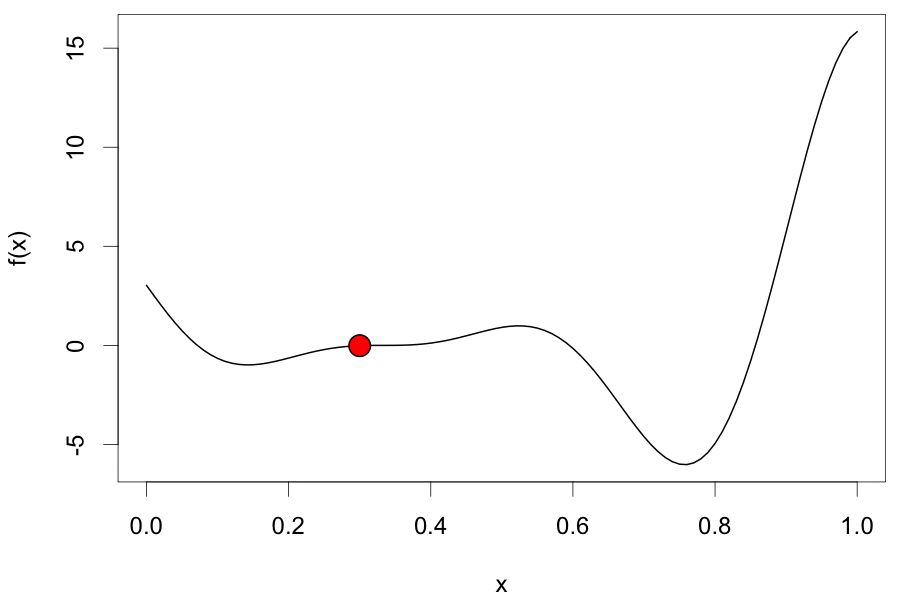

```{r setup, include=FALSE}
knitr::opts_chunk$set(echo = FALSE)
```
```{css}
a.wiki-preview {
    color: #0645ad;
    text-decoration: none;
    border-bottom: 1px dotted #0645ad;
}
.wiki-preview::after {
    font-family: serif;
    content: " W";
    vertical-align: super;
    font-size: 6pt;
}
```

<!-- https://chimeces.com/context-cards/ -->
<script src="https://unpkg.com/context-cards/dist/context-cards.js"></script>

# Introduction

<a href="https://en.wikipedia.org/wiki/Mathematical_optimization" class='wiki-preview' data-wiki-lang='en' data-wiki-title='Mathematical optimization'>Optimization</a> of function $f$ is finding an input value $\mathbf{x}_*$ which minimizes (or maximizes) the output value:

$$
\mathbf{x}_* = \underset{\mathbf{x}}{\arg\min}~f(\mathbf{x})
$$

In this tutorial we will optimize $f(x) = (6(x-2)^2)~\text{sin}(12x-4)$^[from [documentation for Pyro](http://pyro.ai/examples/bo.html)], which looks like this when $x \in [0, 1]$:

```{r curve}
par(mar = c(4.1, 4.1, 0.5, 0.5), cex = 1.1)
curve((6 * x - 2)**2 * sin(12 * x - 4), 0, 1, xlab = "x", ylab = "f(x)", lwd = 2)
```

The ideal scenario is that $f$ is known, has a closed, analytical form, and is differentiable -- which would enable us to use gradient descent-based algorithms For example, here's how we might optimize it with Adam[@Adam] in TensorFlow[@r-tf]:

```{r tf, echo=TRUE, eval=FALSE}
library(tensorflow)
sess = tf$Session()

x <- tf$Variable(0.0, trainable = TRUE)
f <- function(x) (6 * x - 2)**2 * tf$sin(12 * x - 4)

adam <- tf$train$AdamOptimizer(learning_rate = 0.3)
opt <- adam$minimize(f(x), var_list = x)

sess$run(tf$global_variables_initializer())

for (i in 1:20) sess$run(opt)
# x_best <- sess$run(x)
```



But that's not always the case. Maybe we don't have a derivative to work with and the evaluation of the function is expensive -- hours to train a model or weeks to do an A/B test. Bayesian optimization (BayesOpt) is one algorithm that helps us perform derivative-free optimization of black-box functions.

# Algorithm

The BayesOpt algorithm for $N$ maximum evaluations can be described using the following pseudocode[@Frazier2018id]:

```
Place Gaussian process prior on 'f'
Observe 'f' at n0 initial points; set n = n0
while n ≤ N do:
  Update posterior on 'f' using all available data
  Compute acqusition function 'a' using posterior
  Let x* be the value which maximizes 'a'
  Observe f(x*)
  Increment n
end while
Return x for which f(x) was at its best
```

We seed the algorithm with a few initial evaluations and then proceed to sequentially evaluate new values, chosen based on some acqusition function, until we've exhausted the number of attempts we're allowed to make.

## Acquisition Functions

Let $\tau$ be the best observed value of $f_n$ (the $n$ evaluations of $f$). How do we choose the next value at which to evaluate $f$? We use an *acquisition function* to guide our choice. There are three major acquisition functions out there, each with its own pros and cons:

1. **Probability of improvement**: $a_\text{PI}(x)$ measures the probability that a point $x$ will lead to an improvement over $\tau$
2. **Expected improvement**: $a_\text{EI}$ incorporates the amount of improvement 
3. **GP lower confidence bound**: $a_\text{LCB}$ (*upper* in case of maximization) balances *exploitation* (points with best expected value) against *exploration* (points with high uncertainty).

In the sections below, each acquisition function will be formally introduced and we'll see how to implement it in R[@r-base].

# Implementation


## Dependencies

We will use the **GPfit**[@r-GPfit] package to fit a <a href="https://en.wikipedia.org/wiki/Gaussian_process" class='wiki-preview' data-wiki-lang='en' data-wiki-title='Gaussian_process'>Gaussian process</a> in each iteration of the algorithm and obtain estimates necessary for the acquisition functions.

```{r deps, echo=TRUE}
library(GPfit) # install.packages("GPfit")
```

# Further reading

- [@Snoek2012vl] explains how BayesOpt may be used for automatic parameter tuning in machine learning
- [@Shahriari2016je] provides a comprehensive review of the algorithm and its applications
- [@Letham2018ep] shows how Facebook uses BayesOpt to find next set of parameter values to evaluate with online experiments (A/B tests)
- [@Chen2018ta] shows how DeepMind used BayesOpt to tune AlphaGo during development
- [@Gortler2019a] is a visual exploration of Gaussian processes
